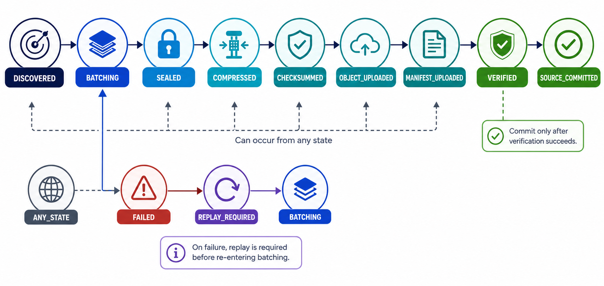
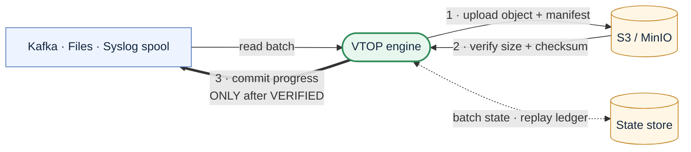

<div align="center">


# VTOP Engine

**Verified Telemetry Object Protocol Engine**

Replay-safe, manifest-driven telemetry transfer from Kafka, files, and syslog spools into object storage.

<br />

[](https://github.com/allamiro/vtop-engine/actions/workflows/ci.yml?query=branch%3Amain)
[](LICENSE)
[](https://www.rust-lang.org)
[](#status)
[](#upload-and-verification)
[](#core-rule)

</div>

---

## Overview

**VTOP Engine** moves telemetry into object storage while protecting the source commit point.

It ingests telemetry from:

- Kafka topics
- append-only log files
- syslog spool files

For every batch, VTOP:

1. reads records from a source
2. forms a batch
3. compresses the batch
4. computes a checksum
5. creates a manifest
6. uploads the object and manifest
7. verifies the uploaded data
8. commits source progress only after verification succeeds

> [!IMPORTANT]
> VTOP does **not** commit Kafka offsets, file byte offsets, or syslog spool offsets until the destination object has been verified.

---

## Status

> [!NOTE]
> VTOP Engine is currently a **prototype / reference implementation** of a proposed protocol and proposed method.
>
> This repository is intended to support candidate-invention disclosure work. It is **not** patented or patent-pending.
>
> See [docs/INVENTION_DISCLOSURE_DRAFT.md](docs/INVENTION_DISCLOSURE_DRAFT.md).

---

## Table of contents

- [Overview](#overview)
- [Status](#status)
- [Why VTOP exists](#why-vtop-exists)
- [Core rule](#core-rule)
- [How it works](#how-it-works)
- [State machine](#state-machine)
- [Supported source modes](#supported-source-modes)
- [Format detection](#format-detection)
- [Architecture](#architecture)
- [Quick start](#quick-start)
- [Build and test](#build-and-test)
- [CLI usage](#cli-usage)
- [Docker lab](#docker-lab)
- [Example manifest](#example-manifest)
- [Metrics](#metrics)
- [Upload and verification](#upload-and-verification)
- [Replay and recovery](#replay-and-recovery)
- [Known limitations](#known-limitations)
- [Roadmap](#roadmap)
- [Documentation](#documentation)
- [License](#license)

---

## Why VTOP exists

Most log-to-object-storage pipelines can move bytes into a bucket.

The harder problem is knowing when it is safe to advance the source position.

```text
Did the object land intact,
and is it safe to commit the source offset now?
```

VTOP addresses this with a source-agnostic safety model:

| Capability | Purpose |
|---|---|
| **Manifest-bound transfer** | Binds source progress, object URI, checksum, format, compression, and verification state. |
| **Verify before commit** | Prevents source progress from advancing before destination verification. |
| **Replay-safe state store** | Allows recovery without silently losing unverified data. |
| **Explicit state machine** | Makes unsafe transitions visible and testable. |
| **Pluggable sources and backends** | Applies the same safety model to Kafka, files, syslog spools, and object storage backends. |

---

## Core rule

```text
SOURCE_COMMITTED is forbidden until VERIFIED is true.
```

A source progress marker is never committed until the batch completes this lifecycle:

```text
DISCOVERED
  → BATCHING
  → SEALED
  → COMPRESSED
  → CHECKSUMMED
  → OBJECT_UPLOADED
  → MANIFEST_UPLOADED
  → VERIFIED
  → SOURCE_COMMITTED
```

Failure can happen from any state:

```text
ANY_STATE
  → FAILED
  → REPLAY_REQUIRED
  → BATCHING
```

> [!CAUTION]
> Transitions such as `SEALED → SOURCE_COMMITTED` or `OBJECT_UPLOADED → SOURCE_COMMITTED` are invalid.

---

## How it works

At a high level, VTOP separates source progress from destination durability.

```text
Source records
  → batch
  → compressed object
  → checksum
  → manifest
  → upload object
  → upload manifest
  → verify object and manifest
  → commit source progress
```

The manifest acts as the transfer evidence record.

It links:

- source type
- source name
- source progress marker
- object URI
- object checksum
- compression type
- detected format
- batch metadata
- reproducible manifest self-hash and optional keyed-BLAKE3 authentication

---

## State machine



The state machine is the enforcement point for safe progress.

Only this final transition is valid:

```text
VERIFIED → SOURCE_COMMITTED
```

Invalid examples:

```text
SEALED → SOURCE_COMMITTED
COMPRESSED → SOURCE_COMMITTED
CHECKSUMMED → SOURCE_COMMITTED
OBJECT_UPLOADED → SOURCE_COMMITTED
MANIFEST_UPLOADED → SOURCE_COMMITTED
```

Relevant implementation:

- [crates/vtop-core/src/state_machine.rs](crates/vtop-core/src/state_machine.rs)
- [docs/VTOP_PROTOCOL_DRAFT.md](docs/VTOP_PROTOCOL_DRAFT.md)

---

## Supported source modes

| Source mode | Progress marker | Behavior |
|---|---|---|
| **Kafka** | topic, partition, offset range | Uses a Kafka consumer with auto-commit disabled. Each batch contains records from one topic and one partition. Offsets are committed only after verification. |
| **File** | path, inode, byte range | Reads append-only files line by line. Partial trailing lines are not committed. Replay resumes from the last safe byte offset. |
| **Syslog spool** | spool ID, byte range | Treats rsyslog or syslog-ng spool files as append-only inputs. External collectors own syslog delivery; VTOP owns batching, upload, verification, replay, and commit safety. |

---

## Format detection

VTOP is not fixed to one telemetry format.

When a stream does not explicitly define a format in [examples/streams.yaml](examples/streams.yaml), the engine detects the format per batch.

Supported detected formats:

| Format | Example output extension |
|---|---|
| CEF | `.cef.gz` |
| JSON | `.json.gz` |
| JSON Lines | `.jsonl.gz` |
| Syslog | `.syslog.gz` |
| Plain text | `.txt.gz` |

A single engine can process different formats across different streams.

For example:

```text
source A → CEF
source B → JSON Lines
source C → syslog
source D → mixed batches
```

The detected format is recorded in the manifest.

Relevant implementation:

- [crates/vtop-core/src/detect.rs](crates/vtop-core/src/detect.rs)

---

## Architecture

<div align="center">

&nbsp;&nbsp;&nbsp;
&nbsp;&nbsp;&nbsp;
&nbsp;&nbsp;&nbsp;
&nbsp;&nbsp;&nbsp;


</div>

The engine reads from a source, writes a **compressed object plus a manifest** to
object storage, **verifies** what it wrote, and only then advances the source
commit point. Verification failure means the source is never committed, so the
data stays replayable.



Steps **1 → 2 → 3** are the whole protocol: the thick arrow is the one rule that
must never break — see [Core rule](#core-rule).

### Workspace layout

VTOP is organized as a Rust workspace.

```text
crates/
  vtop-core/       protocol-independent logic:
                   state machine, batching, manifests,
                   checksums, compression, partitioning,
                   config, replay

  vtop-adapters/   source adapters:
                   Kafka, file, syslog spool

  vtop-upload/     upload backends:
                   native S3, s3cmd, awscli, MinIO, mock

  vtop-state/      durable SQLite state store

  vtop-cli/        vtopctl CLI and engine runtime

examples/          example config and sample streams
docs/              protocol, architecture, security, invention notes
docker/            container build files and seed scripts
tests/             integration tests
benchmarks/        benchmark and performance test support
```

> [!TIP]
> Keep detailed internals in `docs/`. The README should stay focused on orientation, quick start, and key guarantees.

Full architecture documentation:

- [docs/ARCHITECTURE.md](docs/ARCHITECTURE.md)

---

## Quick start

Run the full Docker lab:

```bash
docker compose up -d
docker compose logs -f vtop-engine
```

Or build and run locally:

```bash
cargo build --release
cargo run -p vtop-cli -- discover --config examples/config.yaml
```

---

## Build and test

```bash
cargo fmt --all --check
cargo clippy --workspace --all-targets -- -D warnings
cargo test --workspace
cargo build --release
```

CI runs formatting, linting, tests, and release build on push and pull request.

Workflow file:

```text
.github/workflows/ci.yml
```

---

## CLI usage

The CLI binary is `vtopctl`.

```bash
cargo run -p vtop-cli -- run \
  --config examples/config.yaml

cargo run -p vtop-cli -- discover \
  --config examples/config.yaml

cargo run -p vtop-cli -- process-once \
  --source kafka \
  --config examples/config.yaml

cargo run -p vtop-cli -- process-once \
  --source file \
  --config examples/config.yaml

cargo run -p vtop-cli -- replay \
  --batch-id <batch_id> \
  --config examples/config.yaml

cargo run -p vtop-cli -- status \
  --config examples/config.yaml

cargo run -p vtop-cli -- list-batches \
  --config examples/config.yaml \
  --json

cargo run -p vtop-cli -- verify-manifest \
  --manifest s3://telemetry-data/.../batch.manifest.json \
  --config examples/config.yaml
```

Common CLI behavior:

| Option | Purpose |
|---|---|
| `--json` | machine-readable output |
| `--log-level` | runtime log level |
| non-zero exit | command failure |
| secret-safe output | commands should not print credentials |

---

## Docker lab

The Docker lab provides Kafka, MinIO, seeded telemetry, and the VTOP engine.

| Service | Purpose |
|---|---|
| `kafka` | test Kafka broker |
| `kafka-ui` | browser UI at `http://localhost:8080` |
| `minio` | S3-compatible object storage |
| `minio-init` | bucket initialization |
| `kafka-init` | seeded test events |
| `vtop-engine` | VTOP runtime |
| `rsyslog` | optional syslog collector profile |

MinIO endpoints:

```text
API:     http://localhost:9000
Console: http://localhost:9001
Bucket:  telemetry-data
```

Start the lab:

```bash
docker compose up -d
docker compose logs -f vtop-engine
```

---

## Kafka to MinIO example

Start Kafka, MinIO, and seed data:

```bash
docker compose up -d kafka minio minio-init kafka-init
```

Start the engine:

```bash
docker compose up -d vtop-engine
docker compose logs -f vtop-engine
```

Expected lifecycle events:

```text
format_detected
object_uploaded
manifest_uploaded
verification_passed
source_committed
```

Open the MinIO console:

```text
http://localhost:9001
```

Then inspect the `telemetry-data` bucket.

---

## File to MinIO example

Generate test input files:

```bash
docker/seed-events.sh cef    200 > ./data/input/auth.cef.log
docker/seed-events.sh json   200 > ./data/input/app.json.log
docker/seed-events.sh syslog 200 > ./data/input/sys.syslog.log
docker/seed-events.sh mixed  500 > ./data/input/mixed.log
```

Run the engine:

```bash
docker compose up -d vtop-engine
docker compose logs -f vtop-engine
```

Generate additional test data at any time:

```bash
docker/seed-events.sh <cef|json|jsonl|syslog|mixed> [count]
```

Infrastructure-free file-flow test:

```text
tests/integration_file_to_minio.rs
```

---

## Example manifest

```json
{
  "protocol": "VTOP",
  "version": "0.2",
  "batch_id": "vtop-20260618T150000Z-app_events-p0-481000-482499-1a2b3c4d",
  "tenant": "default",
  "source_type": "kafka",
  "source_name": "app_events",
  "format": "cef",
  "compression": "gzip",
  "record_count": 1500,
  "source_progress": {
    "source_type": "kafka",
    "topic": "app_events",
    "partition": 0,
    "start_offset": 481000,
    "end_offset": 482499,
    "consumer_group": "vtop-engine"
  },
  "object": {
    "uri": "s3://telemetry-data/tenant=default/source=app/format=cef/year=2026/month=06/day=18/hour=15/vtop-....cef.gz",
    "size_bytes": 924822,
    "sha256": "abc123..."
  },
  "manifest": {
    "uri": "s3://telemetry-data/.../vtop-....manifest.json",
    "sha256": "def456...",
    "mac": "0123abcd..."
  },
  "state": "manifest_uploaded",
  "verification_status": "not_verified"
}
```

> [!NOTE]
> The manifest is written at `MANIFEST_UPLOADED`, before storage-side verification.
>
> The authoritative post-verification state lives in the state store and can be queried with `vtopctl status` or `vtopctl list-batches --json`.

The manifest self-hash is reproducible and detects accidental changes, but an
attacker able to rewrite the manifest can recompute it. Set
`manifest_mac_key_env` to the name of an environment variable containing a
32-byte hex key to add `manifest.mac`, a keyed BLAKE3 authenticator. Both
embedded values are blanked for canonicalization. The key itself is never
serialized. Enabling a key intentionally rejects older unsigned manifests;
verify the backlog before cutover. Key rotation is not implemented yet.

---

## Metrics

VTOP emits structured per-batch metrics.

Example:

```text
3 records, 114 B->80 B (1.43x, 29.8% saved) in 6 ms | 500 rec/s, 0.00 MiB/s up |
stages: compress=0ms checksum=0ms put_obj=0ms put_manifest=0ms verify=0ms commit=0ms
```

Each batch records:

| Metric area | Examples |
|---|---|
| **Size and transfer** | uncompressed bytes, compressed bytes, compression ratio, percentage saved |
| **Latency** | compression, checksum, object upload, manifest upload, verification, commit |
| **Throughput** | records/sec, uncompressed MiB/sec, effective upload MiB/sec |

`vtopctl process-once --json` includes the full metrics object per batch.

Prometheus metrics are exported by the engine at `/metrics` when `VTOP_METRICS_ADDR` is set. See [observability/](observability/) for the optional Grafana LGTM stack (Alloy + Mimir/Loki/Tempo) and dashboards.

Relevant implementation:

- [crates/vtop-core/src/metrics.rs](crates/vtop-core/src/metrics.rs)

---

## Upload and verification

VTOP supports multiple upload backends.

| Backend | Purpose | Verification level |
|---|---|---|
| native S3 | primary S3-compatible backend | service-computed SHA-256 or streamed BLAKE3 |
| AWS CLI | command-based backend | downloads and hashes stored content |
| s3cmd | command-based backend | downloads and hashes stored content |
| MinIO client | command-based backend | downloads and hashes stored content |
| LocalFS | local/air-gapped backend | streams stored files through the configured digest |
| mock | tests and local integration flow | hashes stored in-memory content |

> [!IMPORTANT]
> Strong verification is the default. A sidecar, ETag, or uploader-written user
> metadata is never accepted as proof of stored content.

---

## Replay and recovery

VTOP recovery is designed around one rule:

```text
Unverified data must remain replayable.
```

Recovery behavior:

| Crash point | Recovery action |
|---|---|
| before object upload | replay from source |
| after object upload but before verification | replay from source |
| after verification but before source commit | retry source commit |
| after source commit | batch is complete |

If verification fails:

```text
batch → FAILED
source progress → not committed
```

If commit fails after verification:

```text
batch → VERIFIED
recovery → retries source commit
```

Relevant tests:

```text
tests/integration_replay.rs
tests/integration_state_recovery.rs
```

---

## Known limitations

VTOP is currently a prototype. The following limits are known and intentional.

| Area | Current behavior | Planned direction |
|---|---|---|
| Large objects | native S3 backend uses single-part `put_object` | add multipart upload |
| Large records / whole files | a whole-file record and an over-budget line are read fully into memory (soft `max_bytes`); a warning is logged | add bounded reads + streaming compression/upload |
| Partial upload recovery | replays from source instead of resuming half-written local objects | add resumable local staging |
| Command backend verification cost | `aws`, `s3cmd`, and `mc` download each stored object to hash it | prefer native S3 SHA-256 when read-back bandwidth is costly |
| Syslog timestamps | `received_time_*` is not yet extracted into the spool marker | add timestamp extraction |
| Manifest integrity | self-hash plus optional keyed-BLAKE3 authentication; key rotation not implemented | add multi-key rotation and public-key signatures if required |
| Object immutability | S3 Object Lock is designed but not implemented | add Object Lock profile |
| Metrics export | **Prometheus `/metrics` implemented** (opt-in via `VTOP_METRICS_ADDR`); OpenTelemetry trace export not yet | add OTLP span export |
| Kafka integration test | requires live broker and is ignored by default | add optional CI service profile |
| Binary / pre-compressed inputs | **supported** via the file source `whole_file` mode (archived verbatim, byte-exact) | streaming for very large files |
| Local filesystem backend | **available** (`backend: localfs`, objects under `local_path/<bucket>/<key>`; sidecars are inventory hints only) | — |
| Checksums | **SHA-256 and BLAKE3**, or disabled (size-only); strong verification defaults on and `require_strong_verification: false` is an explicit weak-mode opt-out | — |

---

## Roadmap

Completed:

- [x] local filesystem upload backend (`backend: localfs`)
- [x] BLAKE3 checksum strategy (and checksum-disabled mode)
- [x] binary / pre-compressed input framing (file source `whole_file` mode)
- [x] strong-verification gate (`require_strong_verification`)
- [x] **Prometheus metrics exporter** — the engine serves `/metrics` (`/healthz`,
      `/readyz`) behind `VTOP_METRICS_ADDR`; see [observability/](observability/)
      for the optional Grafana LGTM stack and dashboards
- [x] **end-to-end smoke + live-broker Kafka CI** over the full compose lab

Planned implementation areas:

- [ ] Kafka feature gate for lighter builds
- [ ] bounded reads + streaming compression/upload for very large records —
      `max_records` / `max_bytes` bound a *batch*, but a single oversized record
      (a long line, a large Kafka message, or `whole_file`) is still buffered
      whole before the budget is checked
- [ ] multipart upload support
- [x] optional keyed-BLAKE3 manifest authentication via a named secret env var
- [ ] manifest MAC key rotation / optional public-key signatures
- [ ] S3 Object Lock profile
- [ ] OpenTelemetry trace export (the metrics endpoint exists; spans do not yet)
- [ ] million-file benchmark suite

---

## Documentation

| Document | Purpose |
|---|---|
| [docs/README.md](docs/README.md) | documentation index |
| [docs/VTOP_PROTOCOL_DRAFT.md](docs/VTOP_PROTOCOL_DRAFT.md) | protocol draft and conformance profiles |
| [docs/ARCHITECTURE.md](docs/ARCHITECTURE.md) | architecture and runtime flow |
| [docs/SECURITY_MODEL.md](docs/SECURITY_MODEL.md) | security model and normative rules |
| [docs/INVENTION_DISCLOSURE_DRAFT.md](docs/INVENTION_DISCLOSURE_DRAFT.md) | candidate-invention disclosure draft |
| [docs/PRIOR_ART_SEARCH_PLAN.md](docs/PRIOR_ART_SEARCH_PLAN.md) | prior-art search plan |


---

## License

[MIT](LICENSE) © 2026 Tamir Suliman.
