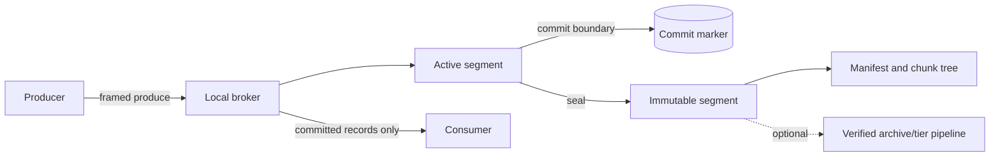
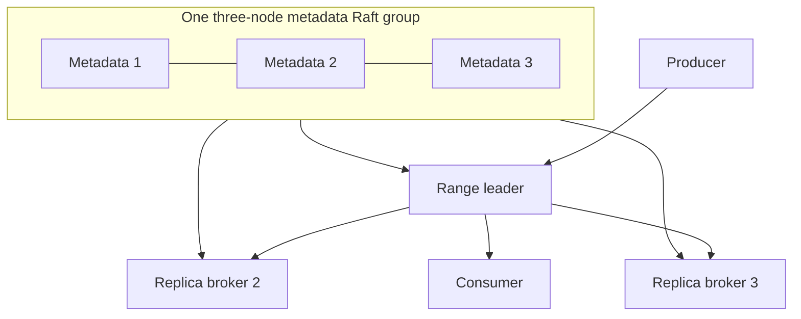
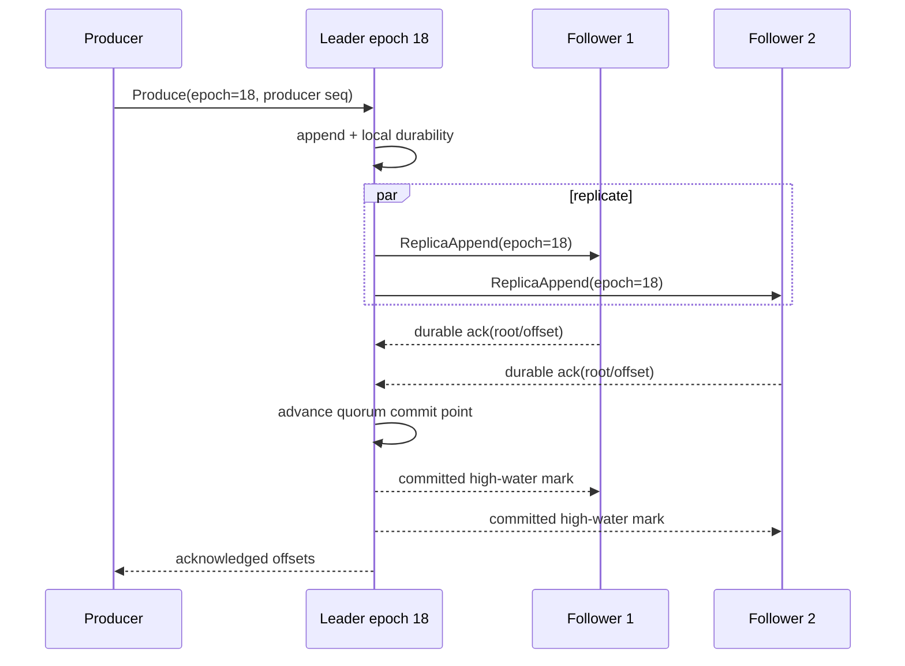
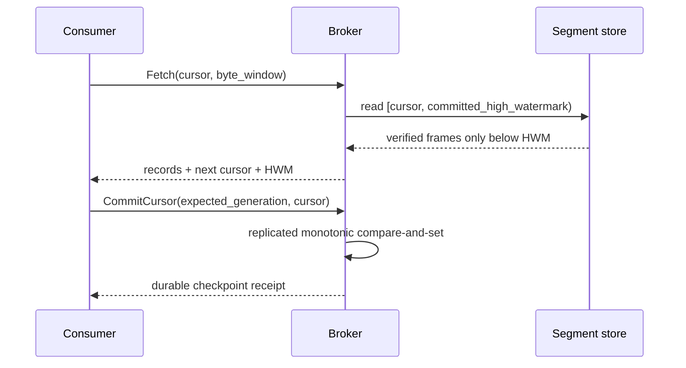
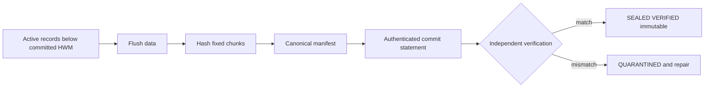
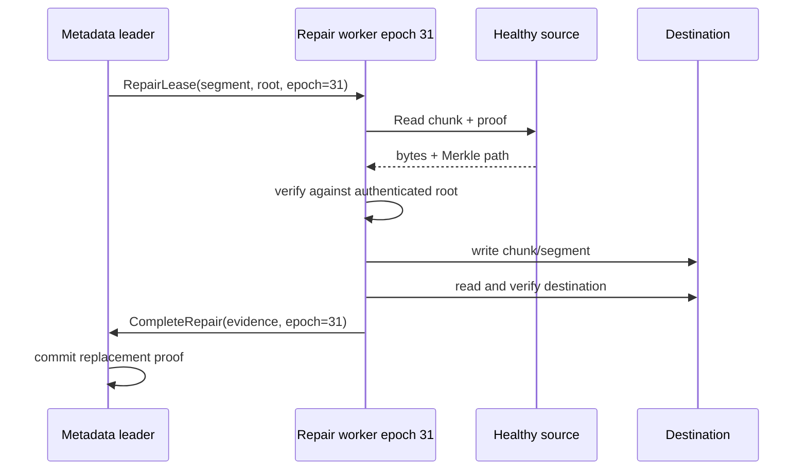
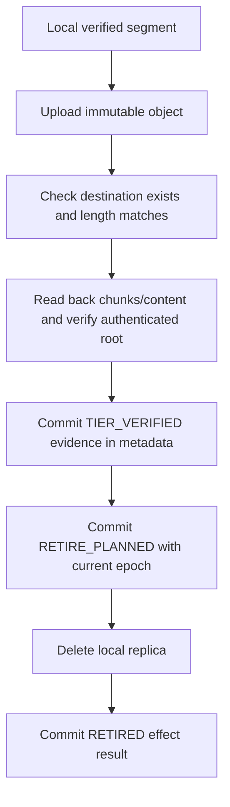
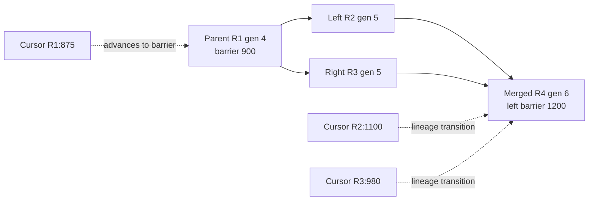

# ADR-0001: VTOP-native distributed telemetry log

- Status: accepted direction; implementation is staged
- Date: 2026-07-19
- Decision owners: VTOP maintainers
- Scope: evolution from verified telemetry archiver to native broker

## 1. Decision

VTOP will own its durable log, broker protocol, cluster metadata, replication,
placement, consumer progress, repair, and retirement rules. Kafka remains an
optional edge adapter. PostgreSQL and object storage remain optional archive
and tier integrations. None of them is a correctness dependency of the native
broker.

The existing verified telemetry pipeline is preserved. Its invariant:

```text
SOURCE_COMMITTED is forbidden until VERIFIED is true
```

becomes the foundation for these broker-level invariants:

1. A producer acknowledgement is returned only after the requested durability
   condition is satisfied.
2. Consumers never observe records above the committed high-water mark.
3. A sealed segment is immutable.
4. A stale leader cannot append, commit, retire, or repair after losing its
   fencing epoch.
5. A replica, local segment, or tier copy cannot be retired until a replacement
   with the expected identity and authenticated content root has been verified
   and that transition has been durably committed.
6. Consumer progress remains monotonic and durable across failover,
   reassignment, range split, and range merge.
7. Corruption is detectable from immutable segment bytes and authenticated
   evidence without trusting mutable broker metadata.

This ADR defines the target and the review boundaries. It does not claim that
the first storage slice already implements clustering or proof-carrying
segments.

## 2. Repository audit

### 2.1 Assets to preserve

| Existing component | Exact code reference | Native-broker use |
|---|---|---|
| Verify-before-commit state machine | `crates/vtop-core/src/state_machine.rs:17-149` | Preserve as the archive/tiering lifecycle; reuse its guarded-transition pattern for native metadata commands. |
| Redundant durable invariant | `crates/vtop-state/migrations/postgres/0001_state_store.sql:3-56`, `crates/vtop-state/src/sqlite_store.rs::update_batch_state`, `crates/vtop-state/src/pg_store.rs::update_batch_state` | Preserve defense in depth. Native metadata obtains the same protection through one deterministic replicated state machine rather than SQL triggers. |
| Source commit gate | `crates/vtop-adapters/src/base.rs:62-158`, `crates/vtop-cli/src/engine.rs::commit_verified` | Kafka, file, and spool stay edge sources. Their progress remains gated by archive verification. |
| Stored-byte verification | `crates/vtop-upload/src/base.rs:86-169`, `crates/vtop-upload/src/base.rs:295-367` | Split verification from deletion. Reuse bounded stored-byte verification behind a native `TierStore` adapter. |
| Recovery re-verification | `crates/vtop-cli/src/engine.rs::storage_still_verified`, `crates/vtop-cli/src/engine.rs::recover` | Basis for tier-copy validation and repair, with segment identity, generation, epoch, and root added. |
| Authenticated archive manifests | `crates/vtop-core/src/manifest.rs::ManifestMacKey`, `VtopManifest::verify_authentication` | Compatibility format for archived batches. Native segment proofs require a separate versioned schema and cluster-authorized commit statement. |
| Adaptive batching | `crates/vtop-core/src/batch.rs::BatchLimits`, `AdaptiveBatcher` | Reuse policy ideas, not the in-memory `Vec<Vec<u8>>` storage representation. |
| Backend behavioral tests | `crates/vtop-state/src/test_battery.rs`, `tests/integration_replay.rs`, `tests/integration_state_recovery.rs` | Pattern for conformance suites over consensus, disk, clock, transport, and tier-store traits. |
| Property and fuzz testing | `crates/vtop-core/tests/prop_state_machine.rs`, `prop_framing.rs`, `fuzz/fuzz_targets` | Extend to segment decoding, recovery, lineage, metadata transitions, and protocol frames. |

The archive pipeline already verifies the actual stored object and manifest,
persists `VERIFIED`, and only then advances source progress. On restart it
re-downloads and authenticates the manifest and re-verifies stored content
before retrying the source commit. This behavior must not be weakened or
replaced by broker acknowledgements.

### 2.2 Coupling to remove or contain

| Finding | Exact code reference | Correction |
|---|---|---|
| Core source identity is a closed Kafka/file/spool enum. | `crates/vtop-core/src/types.rs:16-52` | Keep it for archive compatibility. Introduce native topic/range/segment identities in protocol types rather than adding broker state to `SourceType`. |
| Core progress embeds Kafka partition and consumer-group details. | `crates/vtop-core/src/types.rs:189-259` | Keep `ProgressMarker` for edge ingestion. Native consumers use lineage-aware cursors and durable group checkpoints. |
| Source reads materialize record bodies in memory. | `crates/vtop-adapters/src/base.rs:19-35` | Adapters feed bounded append groups into the native broker or legacy archive path. Native storage writes record bodies once. |
| Archive ownership uses owner strings, host-clock leases, and an optional shared SQL store. | `crates/vtop-state/src/store.rs:109-138` | Do not promote this to cluster leadership. Native authority is a committed metadata term/epoch checked at every mutation boundary. |
| Object deletion is exposed directly on the backend trait. | `crates/vtop-upload/src/base.rs:351-352` | Broker code receives no raw delete capability. A verified-retirement coordinator alone may invoke a private delete operation after a committed proof. |
| Existing HA documents treat Kafka groups and PostgreSQL as the coordinator. | `docs/PRODUCTION_HA_PLAN.md`, `docs/PRODUCTION_HA_ROADMAP.md` | These documents describe HA for the legacy archiver only. They are not the native-broker architecture. |
| Existing protocol draft is object-transfer oriented. | `docs/VTOP_PROTOCOL_DRAFT.md` | Retain it as the archive profile. Define native produce/fetch/replication as a separate versioned protocol. |

### 2.3 Review of the first `vtop-log` slice

The current slice establishes useful local primitives: bounded frames,
checksums, single-write record bodies, idempotent producer sequences, sparse
indexes, active/sealed files, a committed read boundary, and strict recovery
of torn versus corrupt frames.

It is not yet a proof-carrying or cluster-safe segment implementation:

- `SegmentManifest::blake3_root` is one linear digest, not a chunk-verifiable
  BLAKE3 tree.
- The manifest has no segment generation, leader fencing epoch, producer epoch,
  committed high-water mark, authenticated commit statement, replica evidence,
  or tier evidence.
- `SegmentCursor` binds an offset but not the complete split/merge traversal
  evidence needed to resume after topology evolution.
- `vtop-log` combines protocol types, codec, and concrete filesystem behavior;
  deterministic disk and fault simulation need narrow seams before replication.
- The audit found that recovery originally treated every complete frame as
  committed, which could promote a buffered tail after restart. The first
  slice now persists a checksummed local commit boundary after `sync_data`,
  recovers only through that boundary, and truncates any surviving tail.
- Sealing now durably advances that local boundary before publishing the
  immutable segment. This is local durability only, not a quorum commit proof.
- Startup discovery, quarantine, concurrent producers, bounded queues,
  backpressure, crash-point tests, property tests, fuzzing, and native storage
  benchmarks remain future work.

These are staging gaps, not reasons to discard the slice. The first merge must
keep the committed-boundary regression tests and accurately label all
unimplemented guarantees.

## 3. System boundaries

The eventual workspace boundary is:

```text
vtop-protocol  identities, wire envelopes, cursors, manifests, proofs
vtop-storage   segment codec, local store traits, recovery, indexes
vtop-broker    produce/fetch sessions, admission, high-water marks
vtop-metadata  deterministic metadata commands/state machine
vtop-consensus narrow VTOP-owned consensus interface; openraft adapter
vtop-replica   leader/follower replication and repair
vtop-tier      verified upload, restore, retirement orchestration
vtop-adapters  optional Kafka/file/syslog edge ingestion
```

The first PR may keep a smaller `vtop-log` crate while the API settles. It must
not add placeholder crates merely to match this list.

### 3.1 Dependency policy

- Tokio is the asynchronous runtime behind VTOP interfaces.
- `openraft` may implement consensus mechanics and membership changes behind
  `Consensus`, but its public types do not cross VTOP crate or wire boundaries.
- BLAKE3 supplies record, chunk, tree, and segment integrity.
- `foca` is deferred until measured membership scale requires SWIM-style
  dissemination. Raft membership remains authoritative.
- `madsim`, or a runtime-neutral equivalent, is adopted only if disk, network,
  clock, restart, RNG, and corruption behavior can all be controlled.
- Framed TCP with TLS is the initial peer and client transport. QUIC requires a
  benchmark demonstrating an operational or performance benefit.
- Buffered file I/O and `fdatasync`/`sync_data` are the baseline. Direct I/O and
  `io_uring` are optional measured implementations of the same storage trait.
- RocksDB, ZooKeeper, MySQL, Vitess, Couchbase, Kafka, PostgreSQL, and S3 are not
  mandatory native-broker dependencies.

Rejected: using Kafka groups, PostgreSQL leases, or S3 as the native control
plane would deliver a new archive deployment topology, not a VTOP-native
broker. It would also make fencing and availability depend on external
systems with different failure models.

## 4. Deployment architecture

### 4.1 Single-node milestone



The first executable milestone is one process, one local durable log, one
range per topic, and local produce/fetch. No Raft, replication, membership,
placement, or consumer groups are implied.

### 4.2 Initial three-node cluster



Metadata keys include a shard prefix from day one, but only one group exists.
Sharding is introduced only after profiling demonstrates a metadata hotspot.

Rejected: dozens or hundreds of initial Raft groups multiply elections,
snapshots, operational states, and simulation combinations before correctness
of one group is established.

## 5. Data and storage model

```text
topic -> topic epoch -> buddy-aligned key range -> range generation
      -> ordered segment generations -> logical record offsets
```

- Topic names map to stable topic IDs. Re-creation increments `topic_epoch` so
  old cursors cannot attach to a different logical topic with the same name.
- A range covers a buddy-aligned prefix of a 64-bit routing hash. It has a
  stable range ID and a monotonically increasing generation.
- Split creates two children with one parent. Merge creates one child with two
  buddy parents. Lineage changes are committed metadata commands.
- A segment belongs to exactly one topic epoch and range generation. Its
  `segment_generation` is monotonic within that range generation.
- Record offsets are logical and monotonic within the lineage-defined stream;
  physical byte positions are reconstructible indexes, not consumer identity.
- Record bodies are written once to the active segment. Sparse indexes,
  producer tables, chunk trees, and manifests are reconstructible metadata.

Rejected: a second WAL duplicates the largest bytes and complicates proof
identity. If later measurements require a WAL, it must store references or
metadata rather than a second copy of record bodies.

### 5.1 Baseline local durability

The storage baseline separates three positions:

- `accepted`: bytes validated and written to the process/file cache;
- `local_durable`: record data passed `sync_data`, followed by a durable
  checksummed commit-boundary update;
- `cluster_committed`: a current leader epoch has quorum evidence and the
  committed point has been advanced.

Single-node durable acknowledgements use `local_durable`. Cluster quorum
acknowledgements use `cluster_committed`. Consumers use only the relevant
committed position, never `accepted`.

Rejected: inferring commit from “complete frames found after restart.” Page
cache writeback may persist buffered frames in arbitrary subsets, so physical
survival is not proof that the configured durability barrier completed.

## 6. Segment binary and proof format

All integers are unsigned big-endian unless explicitly declared. Every
variable-length item is preceded by a bounded length. Decoders reject unknown
major versions, overflow, over-limit allocation, invalid order, and trailing
bytes. Minor-version additions use length-delimited extension sections.

### 6.1 Active segment

```text
SegmentHeaderV1
  magic, major, minor, header_len, header_checksum
  topic_id, topic_epoch
  range_id, range_generation, key_prefix, key_prefix_bits
  segment_id, segment_generation, base_offset
  creation_leader_id, creation_fencing_epoch
  record_schema_version, chunk_size, configured_limits

RecordFrameV1 repeated
  magic, frame_len, relative_offset
  producer_id, producer_epoch, producer_sequence
  timestamp, attributes_len, key_len, value_len
  attributes, key, value, frame_checksum
```

The producer epoch fences a restarted or superseded producer identity.
Sequence state is scoped by `(producer_id, producer_epoch)` and retained long
enough to make retries unambiguous across segment roll.

### 6.2 Durable commit marker

```text
CommitBoundaryV1
  magic, version, segment_id, segment_generation
  fencing_epoch, committed_next_offset, committed_data_len
  generation_counter, checksum
```

In the single-node milestone this is an atomic, checksummed sidecar written
only after segment `sync_data`. In the clustered design it is derived from the
replicated commit statement and cannot advance under a stale epoch. Recovery
never advances beyond this marker and may truncate a surviving uncommitted
tail.

### 6.3 Sealed proof-carrying segment

The canonical manifest binds:

- format and record schema versions;
- topic ID/name and topic epoch;
- range ID, generation, key interval, and direct lineage parents;
- segment ID, generation, base/next offsets, record count, and byte length;
- producer sequence summary and committed high-water mark;
- chunk size, ordered chunk hashes, and BLAKE3 tree root;
- sealing leader ID and fencing epoch;
- authenticated commit statement;
- replica verification evidence and optional tier verification evidence;
- signature/MAC scheme, key ID, and domain-separated authentication value.

The commit statement covers the manifest digest, content root, identity,
epoch, and committed high-water mark. A verifier receives the manifest,
statement, key material/trust policy, chunk bytes, and Merkle path; mutable
broker metadata is optional context, not an integrity oracle.

Rejected: calling a whole-file hash a proof tree. A linear digest detects
whole-segment corruption only after reading the full segment and cannot verify
an isolated repair or consumer chunk.

Rejected: treating the existing symmetric archive manifest MAC as the final
cluster attestation. It is valuable for the archive profile, but cluster
authorization, key rotation, offline auditing, and quorum evidence need an
explicit versioned trust model.

## 7. Metadata state machine

One deterministic command state machine owns:

```text
/cluster/config
/nodes/{node_id}
/topics/{topic_id}
/ranges/{topic_id}/{range_id}
/segments/{topic_id}/{range_id}/{segment_id}
/groups/{group_id}/members/{member_id}
/groups/{group_id}/cursors/{topic_id}/{range_id}
/keys/{key_id}
```

The leading categories are future shard boundaries. Commands carry a unique
request ID, expected object generation, and expected fencing epoch. Duplicate
request IDs return the original result. A generation or epoch mismatch is a
deterministic rejection.

### 7.1 Segment lifecycle

```text
ALLOCATED -> ACTIVE -> SEALING -> SEALED_UNVERIFIED -> VERIFIED
VERIFIED -> REPAIRING -> VERIFIED
VERIFIED -> TIER_COPYING -> TIER_VERIFIED
VERIFIED or TIER_VERIFIED -> RETIRE_PLANNED -> RETIRED
any non-retired state -> QUARANTINED
```

`RETIRE_PLANNED` requires a committed `ReplacementProof` naming the source,
destination, expected length, authenticated root, segment identity/generation,
verification method, verifier, and verification time/term. Physical deletion
is an idempotent effect after that metadata command commits. A stale worker
cannot create the command because its epoch is rejected.

### 7.2 Range lifecycle

```text
ACTIVE -> SPLIT_PREPARED -> SPLIT_CUTOVER -> RETIRED
ACTIVE + ACTIVE_BUDDY -> MERGE_PREPARED -> MERGE_CUTOVER -> RETIRED
```

Cutover records a barrier offset for each parent and the ordered child mapping.
Parent ranges remain readable until all durable consumer cursors and retention
rules permit retirement.

## 8. Consensus, fencing, and replication

`openraft` is isolated behind a VTOP-owned interface conceptually equivalent
to:

```rust,ignore
trait Consensus {
    async fn propose(&self, command: MetadataCommand) -> Result<CommitReceipt>;
    async fn read_index(&self) -> Result<ReadFence>;
    async fn change_membership(&self, change: MembershipChange)
        -> Result<CommitReceipt>;
    fn watch_applied(&self) -> AppliedStateStream;
}
```

VTOP serializes `MetadataCommand` and persisted state. It does not persist or
send `openraft` types. The first group has three voters. Metadata snapshots are
checksummed, versioned, atomically installed, and recoverable under simulation.

Every leader grant produces a monotonically increasing fencing epoch for the
range. The epoch is embedded in replication sessions, append batches, commit
statements, seal commands, repair leases, and retirement proofs. Followers and
metadata commands independently reject lower epochs.

Rejected: time-based SQL leases for leadership. Clock skew and delayed workers
can overlap. A lease may be an optimization, but committed epochs are the
safety boundary.

### 8.1 Producer quorum acknowledgement



An ack policy is explicit (`local_durable`, `quorum`, and later
`all_in_sync`). The default clustered policy is quorum. Backpressure is based
on bounded bytes and sessions, not unbounded request counts.

### 8.2 Consumer committed visibility



Followers may serve reads only with a committed point proven current enough
for the requested consistency. They never infer visibility from their local
file length.

## 9. Sealing, verification, repair, and tiering

### 9.1 Seal and verification



Sealing never includes bytes above the committed point. Publication uses
temporary names, data sync, atomic rename, and directory sync. Recovery
classifies incomplete publication without overwriting an existing sealed ID.

### 9.2 Replica repair



Repair is pull-based and idempotent. The destination verifies identity, epoch,
length, and root; it does not trust a source-side “copy succeeded” response.

### 9.3 Verified tier retirement



Object-store replication by itself is not VTOP verification. Weak
size/existence-only verification can support a lab/archive compatibility mode,
but it cannot authorize native replica retirement.

Rejected: direct access to `UploadBackend::delete_object` from placement,
repair, or retention code. Capability separation prevents an unchecked copy
result from becoming deletion authority.

## 10. Lineage-aware cursors and consumer groups

A durable cursor contains:

```text
CursorV1
  group_id, topic_id, topic_epoch
  range_id, range_generation
  segment_id, segment_generation, segment_root
  record_offset, record_index
  lineage_transition_id (optional)
  parent_barriers[] and child choice/progress (during split/merge)
  checkpoint_generation
```

The commit command is a compare-and-set on `checkpoint_generation`. A cursor
may advance within its segment, cross to the next verified segment, or traverse
a committed lineage transition. It may never move backward or change topic
epoch. Replayed requests are idempotent.

### 10.1 Split/merge cursor lineage



At split, the parent is consumed through its barrier before routing by child
range. At merge, progress is a two-parent frontier until both barriers are
crossed; only then can it collapse to the merged child cursor. Old segment
roots remain part of the transition evidence until retention is safe.

Rejected: translating cursors to a bare integer offset. The same integer can
identify different records after topic recreation or range evolution.

Consumer membership initially uses the metadata group for durable assignments
and checkpoints. A bounded session layer handles heartbeats and incremental
rebalance. Ephemeral liveness does not replace committed cursor ownership.

## 11. Placement and membership

Placement is deterministic and auditable:

1. Filter nodes by hard constraints: health eligibility, storage class,
   protocol version, tenant policy, and distinct failure domains.
2. Score eligible nodes using weighted rendezvous hashing over stable IDs.
3. Apply capacity/load weights with bounded change and record the decision
   inputs in metadata.
4. Schedule small, rate-limited repairs or moves. Never retire the old copy
   before verified replacement evidence commits.

New sealed segments are striped across eligible nodes so new capacity receives
new work naturally. Existing data is moved only for policy, health, or measured
imbalance.

Rejected: making placement correctness depend on a separate Cruise Control
service. A later optimizer may propose plans, but VTOP validates and commits
every move through its own state machine.

Raft configuration is the authoritative node set initially. If large measured
fleets make failure dissemination a bottleneck, `foca` may distribute
suspicions as hints. SWIM suspicion never independently removes a voter,
changes placement, or fences a leader.

## 12. Peer protocol and security

The first protocol uses length-delimited framed TCP over TLS 1.3 with mutual
node authentication. Each connection negotiates protocol versions, cluster
ID, node ID, role, frame/window limits, and a fresh session nonce. Frames carry
request IDs, stream IDs, range identity, fencing epoch, bounded payload length,
and checksum/MAC where applicable.

Separate message families cover metadata, produce, fetch, replication, repair,
and control. Authorization is least-privilege by role and tenant. Repair and
retirement credentials are distinct capabilities. Secrets and TLS material are
resolved at runtime and never serialized into ordinary config or manifests.

Authenticated segment statements use domain separation and key IDs. Key
rotation retains old verification keys until every dependent segment is
retired. The exact symmetric/asymmetric scheme is deferred pending threat-model
and prior-art review.

Rejected: QUIC in the first protocol. It adds implementation and operational
surface before head-of-line blocking, connection migration, or multiplexing
benefits have been measured for VTOP traffic.

## 13. Backward compatibility and migration

- The existing archive CLI, manifest v0.2, state machine, SQLite/PostgreSQL
  ledgers, upload backends, and Kafka/file/spool adapters remain supported.
- Kafka is built as an optional feature and can ingest into either the legacy
  archive pipeline or, later, a VTOP-native topic.
- Native segments use a new format name and major version. They are never
  parsed as legacy telemetry objects.
- A bridge tierer may consume a sealed native segment and create the existing
  archive object/manifest profile, or store the native segment and its proof as
  a new object type. Both paths retain verify-before-retire.
- PostgreSQL-backed archiver HA remains a deployment option, not native cluster
  metadata.
- Migration is additive: deploy native broker, mirror/ingest, verify cursors
  and archives, then cut producers/consumers over. No in-place reinterpretation
  of Kafka offsets as native cursors is allowed.

## 14. Failure behavior

| Failure | Required behavior |
|---|---|
| Torn active tail | Truncate only bytes beyond the durable commit boundary after validating the last committed frame. |
| Complete but uncommitted tail survives restart | Hide and truncate it; never infer commit from survival. Producer retry is safe through epoch/sequence rules. |
| Checksum failure below committed point | Quarantine the local segment; do not serve it; repair from a verified replica/tier. |
| Crash during seal | Recover either active+commit marker or one complete sealed generation; never expose a partial seal. |
| Leader loses epoch during append | Followers reject old epoch; leader returns no success and cannot advance commit. |
| Ack lost after quorum commit | Producer retry receives the original offsets from idempotency state. |
| Replica copy reports success but bytes differ | Verification fails; source replica remains; repair is retried/quarantined. |
| Metadata unavailable | Existing committed reads may continue under explicit lease/read-fence policy; no leadership, retirement, reassignment, or new proof authorization. |
| Tier unavailable | Local retention pauses; producer admission/backpressure follows configured reserve policy. |
| Topic recreated with same name | New topic epoch rejects old producer sessions and consumer cursors. |
| Split/merge interrupted | Metadata exposes either pre-cutover or committed post-cutover topology, never an inferred hybrid. |

## 15. Deterministic testing and benchmarks

### 15.1 Required tests

- Codec golden vectors and cross-version decoding.
- Property tests for length limits, offset monotonicity, sequence idempotency,
  range coverage, split/merge lineage, and illegal metadata transitions.
- Crash tests at every write, sync, rename, directory-sync, acknowledgement,
  and metadata-commit boundary.
- Corruption tests for headers, frames, chunks, tree paths, manifests, commit
  markers, indexes, snapshots, and tier copies.
- Concurrency tests for multiple producers, duplicate requests, backpressure,
  slow consumers, seal races, repair races, and leadership loss.
- Three-node deterministic simulations covering partition, delay, drop,
  reorder, duplicate, clock change, disk full, short write, torn write,
  restart, snapshot install, membership change, and corruption.
- Model checks/assertions: no stale-epoch mutation; visible <= committed <=
  quorum durable; retirement implies verified replacement; cursor never
  regresses; sealed identity never changes.
- Legacy regression suites remain green with Kafka both enabled and disabled.

### 15.2 Benchmarks

Measure before optimization:

- append throughput and p50/p95/p99 latency by record size, group size,
  producer count, topic count, and durability policy;
- fetch throughput under byte windows, cold/warm cache, and consumer count;
- recovery time by segment size/count and producer cardinality;
- sealing and BLAKE3 tree cost by chunk size;
- replication throughput under RTT/loss and follower skew;
- repair/tiering bandwidth and verification CPU;
- metadata command/snapshot behavior and split/merge cost;
- buffered I/O versus optional Direct I/O/io_uring; TCP/TLS versus QUIC only
  after the baseline is stable.

No 1M-record/s or fleet-size claim is made without a reproducible end-to-end
configuration and sustained backpressure/soak results.

## 16. Implementation roadmap as small PRs

1. **Local committed-boundary correctness.** Finish the current `vtop-log`
   slice: durable commit marker, `sync_data`, recovery truncation, seal guard,
   golden format tests, corruption tests, and accurate documentation. No
   networking or Raft.
2. **Storage abstractions and startup catalog.** Separate protocol/storage
   types, introduce injectable disk/clock/RNG seams, discover active/sealed
   generations, quarantine ambiguity, and test crash publication.
3. **Native local protocol.** Framed TCP/TLS produce/fetch with negotiation,
   byte windows, bounded queues, producer epochs, and local durable acks.
4. **Proof-carrying segment v2.** Chunk tree, canonical binary/CBOR-like
   manifest contract, authenticated commit statement interface, proofs, and
   independent verifier. Do not label v1 proof-carrying.
5. **One three-node metadata group.** VTOP command/state types, `Consensus`
   abstraction, openraft adapter, snapshots, membership changes, read fences,
   and simulation.
6. **Range replication and fencing.** Leader/follower sessions, quorum commit,
   stale-epoch tests, failover, and idempotent retries.
7. **Consumer groups and lineage cursors.** Durable checkpoints, incremental
   rebalance, split, merge, and retention blockers.
8. **Placement, verification, and repair.** Failure-domain constraints,
   rendezvous placement, verified replacement proofs, rate-limited moves.
9. **Verified tiering and retention.** Adapt existing upload/verifier code,
   capability-separated deletion, restore, key rotation, and archive bridge.
10. **Measured scale work.** Risk-adaptive sealing, optional foca, metadata
    sharding, erasure coding, Direct I/O/io_uring, or QUIC only when benchmarks
    justify each change.

Each PR must state which invariant it strengthens, include failure-path tests,
and avoid bundling a later phase. Future GitHub issues should match these
phases rather than one umbrella “build a cluster” issue.

## 17. Risks and non-goals

Primary risks are incorrect crash semantics, ambiguous producer retry state,
stale-epoch side effects outside Raft, proof/key lifecycle complexity,
split/merge cursor ambiguity, repair storms, and premature optimization. The
mitigations are narrow traits, explicit persisted evidence, bounded work,
deterministic simulation, independent verification, and small staged PRs.

Initial non-goals:

- metadata sharding or hundreds of Raft groups;
- cross-region consensus;
- transactions across topics;
- exactly-once external side effects;
- mandatory erasure coding;
- mandatory SWIM membership;
- Direct I/O, io_uring, or QUIC by default;
- removing the legacy verified archive pipeline;
- novelty or patentability claims before prior-art review.

## 18. Consequences

VTOP takes ownership of substantially more correctness-critical code than the
Kafka-dependent architecture. In return, its value is no longer merely an
archive wrapper around Kafka: it can provide native durability, independently
verifiable segments, verified repair/retirement, and lineage-aware progress.

The cost is justified only if development remains invariant-led and staged.
The existing archive subsystem continues to provide useful value throughout
the transition and becomes a tested foundation for tier verification rather
than discarded work.
